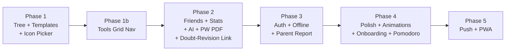

# Nuviora — Comprehensive Improvement Plan

## Overview

This plan covers every improvement area you've described, prioritized into 5 executable phases. The app is a **Next.js 14** PWA backed by **PostgreSQL (Prisma)** with a rich component library. We don't touch auth plumbing or break existing features.

---

## ⚠️ User Review Required

> [!IMPORTANT]
> **AI Feature (Aria):** The `ai-summary` and `ai-study-plan` routes call an external AI API. Before Phase 2, confirm which AI provider key is available (OpenAI, Gemini, etc.) so the chat/Q&A feature can be wired correctly.

> [!WARNING]
> **DB Schema Changes (Phase 3):** The `subjects`/`weakSubjects` JSON-string migration to a proper `UserSubject` table is listed as a future improvement — it's NOT in this plan to avoid breaking existing queries. We'll keep the current JSON string approach but add a helper to parse it safely.

> [!CAUTION]
> **Emoji Icons on Habits:** Replacing emoji icons in the DB (`icon String @default("🎯")`) with Lucide icon names requires a DB migration + seeding. This is MEDIUM risk. We'll add a Lucide icon picker to `add-habit-dialog` but keep emoji as a fallback so existing habits are unaffected.

---

## Phase 1 — 🌱 Core Features Upgrade (Tree + Templates)

### Goal
Upgrade the Pet/Tree companion system with richer visuals, smooth animations, and multi-stage progression. Fix all template selection bugs and ensure every pack shows and works.

---

### Component: Pet Companion (Tree System)

#### [MODIFY] [pet-companion.tsx](file:///c:/Users/brazi/Downloads/HabitFlow1-main%20(1)/HabitFlow1-main/src/components/habits/pet-companion.tsx)

**Current problems:**
- The pet is a static emoji rendered with `text-4xl` — no actual tree/growth animation
- Level-up logic fires on mount if `lastLevel` differs even when not actually levelling up
- Evolution path uses raw emojis in a horizontal carousel, unpolished

**Changes:**
- Replace the emoji rendering with an SVG-based **growth tree** (5 stages: Seed → Sprout → Sapling → Tree → Ancient Tree) drawn with animated SVG paths
- Add `framer-motion` `layoutAnimation` for smooth stage transitions
- Fix the `didMount` ref bug — always set `localStorage` on mount before comparing
- Add a `PetStageProgressBar` that shows the current level within the stage (e.g., "Stage 2 · Lv 6/7")
- Add particle burst animation on level-up instead of just confetti

**New SVG stages (pure CSS/SVG, no external assets):**
```
Stage 1 (Lv 1–3):   Small brown bump with single green leaf
Stage 2 (Lv 4–7):   Short trunk + 2 branches + leaf cluster  
Stage 3 (Lv 8–12):  Taller trunk + fuller canopy (green)
Stage 4 (Lv 13–18): Full tree with fruit/flowers
Stage 5 (Lv 19–25): Grand tree with glow effects
Stage 6 (Lv 26+):   Legendary golden/purple ancient tree
```

---

### Component: Habit Templates

#### [MODIFY] [habit-templates.tsx](file:///c:/Users/brazi/Downloads/HabitFlow1-main%20(1)/HabitFlow1-main/src/components/habits/habit-templates.tsx)

**Current bugs:**
- When `studentClass` is `"11 - Science (PCM)"` the string match `studentClass.includes('PCM')` works, but `"11 - Science"` without a sub-selection returns no stream packs at all (needsStream=true, hasStreamPacks=false) — users on Class 12 Science without PCM/PCB sub-selected get a dead state
- The `selectAll` button toggle logic is broken: it compares `selectedHabits.size === selectedPack.habits.length` but should compare against `getNewHabits(selectedPack).length`
- Pack icon uses emoji (`icon: '⚙️'`) rendered in a gradient div — works fine, keeping this
- After adding habits and closing, `addedCount` state leaks if dialog reopens

**Fixes:**
- Broaden the stream match: if `studentClass` contains "Science" but no sub-type, show a "Pick your science track first" prompt with PCM/PCB/PCMB quick select inside the templates dialog itself (no need to go to Settings)
- Fix `selectAll` to use `getNewHabits(selectedPack).length`
- Reset `addedCount` in `handleClose` (already done partly) — ensure it's cleared on every open too
- Add a "Search packs" filter input at the top of the pack list
- Add a **pack count badge** on the templates button in home dashboard: `3 packs available`

---

### Component: Add Habit Dialog

#### [MODIFY] [add-habit-dialog.tsx](file:///c:/Users/brazi/Downloads/HabitFlow1-main%20(1)/HabitFlow1-main/src/components/habits/add-habit-dialog.tsx)

- Add a **Lucide icon picker** tab alongside the emoji picker so users can choose from ~40 curated Lucide icons (exercise, study, food, sleep, social, misc)
- Store as `lucide:BookOpen` prefix in the icon field (the renderer checks prefix and renders `<LucideIcon />` if present, else renders as emoji character — backwards compatible)

---

## Phase 1b — 🗂️ Navigation Consolidation (Tools Grid)

### Goal
Replace the buried "More / Settings" tab with a discoverable **Tools grid screen** so users can find all 12+ hidden tools in one glance.

---

### What's Hidden Today
The current Settings tab is the only entry point for: Flashcards, Formulas, Mock Tests, Sleep Tracker, Gratitude Log, Energy Tracker, Wellbeing Reflection, Topic Timer, Period Tracker, Challenges, Rewards Shop, AI Summary, Parent Report, Achievement Wall, Revision Reminder, Doubt Bank, Mistake Notebook, Subject Tracker. Most users **never discover** these.

---

### Component: page.tsx — Bottom Navigation

#### [MODIFY] [page.tsx](file:///c:/Users/brazi/Downloads/HabitFlow1-main%20(1)/HabitFlow1-main/src/app/page.tsx)

**Changes:**
- Rename the `settings` tab from **"More"** → **"Tools"** and change its icon from `Settings` → `Grid2x2` (Lucide)
- The `SettingsScreen` stays accessible via a gear icon in the top-right header (next to the theme toggle), freeing the tab for the Tools grid
- Update `tabs` array: replace `{ id: 'settings', label: 'More', icon: Settings }` → `{ id: 'tools', label: 'Tools', icon: Grid2x2 }`
- Add `'tools'` to `TabType` in the store and `TAB_ORDER`

---

### Component: Tools Grid Screen

#### [NEW] `src/components/habits/tools-grid-screen.tsx`

A **3-column icon grid** of all available tools, with:
- Category headers: **Study Tools**, **Wellbeing**, **Social**, **Analytics**
- Each card: rounded icon (Lucide), tool name, 1-line description
- Tapping any card navigates to that tab/screen via `setActiveTab()`
- A subtle "New" badge on recently added tools
- Search/filter bar at the top to find tools by name

```
┌─────────────────────────────┐
│  Tools          🔍 Search   │
├─────────────────────────────┤
│ 📚 STUDY TOOLS              │
│ [Flashcards] [Formulas] [→] │
│ [Mock Tests] [Revision ] [→] │
│ [Doubt Log] [Subjects ] [→] │
├─────────────────────────────┤
│ 💚 WELLBEING                │
│ [Sleep   ] [Gratitude] [→] │
│ [Energy  ] [Period   ] [→] │
│ [Reflection]              │
├─────────────────────────────┤
│ 🤝 SOCIAL & AI              │
│ [Friends ] [Aria AI  ] [→] │
│ [Challenges][Rewards ] [→] │
└─────────────────────────────┘
```

- The gear ⚙️ icon in the header routes to Settings (profile, theme, etc.)
- This makes **zero tools hidden** — everything is 2 taps away

---

## Phase 2 — 🤝 Friends + Stats + AI

### Goal
Make Friends feel like a real social feature with invite links and stats comparison. Upgrade the Stats tab with actual insight cards. Make Aria a real interactive assistant users can chat with.

---

### Component: Friends Screen

#### [MODIFY] [friends-screen.tsx](file:///c:/Users/brazi/Downloads/HabitFlow1-main%20(1)/HabitFlow1-main/src/components/friends/friends-screen.tsx)

**Current state:** Add by username, view friend streak/level/done. No discovery, no comparison.

**New features:**
1. **Shareable invite link** — Generate `nuviora.app/add/@username` and expose a "Copy invite link" button. On that URL, the app auto-populates the "Add Friend" input with the username from the query param.
2. **Side-by-side comparison card** — When tapping a friend, expand to show a comparison: My streak vs theirs, My level vs theirs, My habits done (7-day) vs theirs
3. **Leaderboard mini view** — Sort friends list by current streak (descending) with rank badges (#1 🥇, #2 🥈, #3 🥉)
4. **Empty state improvement** — Replace the generic "No friends yet" with an animated illustration + "Share your link" CTA

#### [NEW] `/api/friends/invite/route.ts`
- `GET /api/friends/invite` → returns `{ inviteUrl: "https://nuviora.app/add/@username" }` built from the user's username

---

### Component: Analytics Screen

#### [MODIFY] [analytics-screen.tsx](file:///c:/Users/brazi/Downloads/HabitFlow1-main%20(1)/HabitFlow1-main/src/components/habits/analytics-screen.tsx)

**New insight cards to add at the top:**
- **Best Day of Week** — Which weekday you complete the most habits (bar chart by day)
- **Consistency Score** — Rolling 30-day percentage with trend arrow up/down
- **Weak Areas** — The 3 habits you miss most, with a "Focus this week" CTA
- **Personal Best Streak** — Show longest streak vs current streak side-by-side
- **Focus Time Trend** — Pomodoro minutes per day over the last 7 days (line chart)

All new cards use the existing `recharts` library already imported.

---

### Component: AI Summary Screen (Aria)

#### [MODIFY] [ai-summary-screen.tsx](file:///c:/Users/brazi/Downloads/HabitFlow1-main%20(1)/HabitFlow1-main/src/components/habits/ai-summary-screen.tsx)

**Current problems:**
- Only shows a weekly summary (no interaction) — just a read-only card
- No fallback for first-time users with no data (blank loading state)
- No chat/Q&A capability despite being called "Your Study Buddy"

**New features:**
1. **Graceful fallback** — If `stats.totalCompleted < 3` show: *"Complete at least 3 habits to unlock your AI summary. Here's what Aria can do for you…"* with a preview list
2. **Chat interface** — Add a message input at the bottom of the AI screen. Users can type questions ("What should I study today?", "How's my streak?") and get responses from the `/api/ai-summary` route extended with a `?q=` param
3. **Skeleton loading** — Replace the pulsing avatar with proper skeleton cards matching the final layout
4. **Conversation memory** — Store the last 6 messages in `localStorage` and send them as context with each API call (simple stateless context window)
5. **Export AI plan as PDF** — Surface the existing `printPlan()` more prominently with a dedicated button

#### [MODIFY] `/api/ai-summary/route.ts`
- Add `?q=` query param handling: if `q` is present, generate a chat response using the user's habit data as context
- Return format: `{ type: 'chat', response: string }`

---

### Feature: PW History PDF — Surface it Better (#7)

#### [MODIFY] `src/components/pw/pw-section.tsx`

**Problem:** The PDF export of the daily study report is hidden several taps deep inside the History sheet within the PW tab. It's a genuine differentiator that most users miss.

**Changes:**
- Add an **"Export Today's Report"** button directly on the PW main screen header (top-right, next to the date) — visible without opening history
- The button triggers the existing PDF export for today's `PWHistory` entry directly
- If today's history hasn't been saved yet, show a toast: *"Complete your day first to export today's report"*

#### [MODIFY] [ai-summary-screen.tsx](file:///c:/Users/brazi/Downloads/HabitFlow1-main%20(1)/HabitFlow1-main/src/components/habits/ai-summary-screen.tsx)

- Add a **"Download Full Study Report"** card in the AI Summary screen below the weekly summary
- This links to the PW tab's PDF export for the current day
- Card copy: *"Your daily study report includes classes attended, tasks completed, and test scores — export it as a PDF."*

---

### Feature: Revision Reminder ↔ Doubt Log Link (#8)

**Problem:** Unresolved doubts in `DoubtLog` table and revision reminders in `RevisionItem` table are completely isolated — two separate data islands.

#### [MODIFY] `src/components/habits/revision-reminder.tsx`

- At the top of the Revision Reminders screen, add a **"Unresolved Doubts"** section
- Fetch unresolved `DoubtLog` entries (`isResolved: false`) and surface them as revision items
- Each unresolved doubt shows: subject, doubt text, and a **"Mark Resolved"** button that calls `PATCH /api/doubts/:id` with `{ isResolved: true }`
- Add a **"Convert to Revision Item"** button on each doubt: creates a `RevisionItem` with the doubt's subject and converts the doubt text to a topic note
- Visual distinction: doubt-sourced revision items get a `Lightbulb` icon badge

#### [MODIFY] `/api/revisions/route.ts`

- When `GET /api/revisions` is called, also include unresolved `DoubtLog` entries in the response (as a separate `unresolvedDoubts` array)
- This keeps the data linked at the API level rather than just the UI

#### [MODIFY] `src/components/habits/quick-doubt-logger.tsx`

- After logging a doubt, show a prompt: *"Add this to your revision schedule?"* with a quick yes/no — if yes, create a `RevisionItem` automatically

---

## Phase 3 — 🔐 Supabase + Data Sync

> [!NOTE]
> This app uses **PostgreSQL via Prisma** (not Supabase directly). The "Supabase" points refer to making auth and data sync bulletproof.

### Goals
- Prevent data loss/reset on page refresh
- Ensure auth headers are always sent
- Add offline support for today's habit completions
- Secure all API routes properly

---

### Component: Session & Auth

#### [MODIFY] [page.tsx](file:///c:/Users/brazi/Downloads/HabitFlow1-main%20(1)/HabitFlow1-main/src/app/page.tsx)

**Current issues:**
- The `window.fetch` interceptor patch is applied in a `useEffect` that fires after the first render — early API calls (fetchHabits, fetchStats in another useEffect) may fire before the interceptor attaches
- The streak freeze UI has no confirmation toast when a freeze is consumed

**Fixes:**
- Move the fetch interceptor to a module-level call in a dedicated `lib/api-client.ts` file that patches fetch at import time (called in the top-level `layout.tsx`)
- Add streak freeze consumed detection: when `stats.graceDayUsed` changes from `false` to `true`, emit a `toast.success("Streak freeze used — your ${streak}-day streak is protected!")`

#### [MODIFY] Layout / API middleware

**Streak freeze UI confirmation:**
- In `home-dashboard.tsx`, detect when `graceDayUsed` flips: show a banner: *"Streak freeze activated — your N-day streak is safe today 🛡️"*

---

### Component: Offline Mode

#### [NEW] `src/lib/offline-cache.ts`
- Cache today's habit completions in `localStorage` as `nuviora-offline-queue`
- On reconnect (listening to `navigator.onLine` / online event), flush the queue by calling `PATCH /api/habits/:id/log`
- Show a subtle "Offline — changes will sync when back online" banner using `navigator.onLine`

#### [MODIFY] Individual habit PATCH in home-dashboard.tsx
- Before calling the API, write to offline queue
- If the API call fails with a network error, don't show an error toast — just leave it queued

---

### Security

#### [MODIFY] All `/api/` routes
- Add consistent `getUserId()` helper that reads from `x-nuviora-user-id` header with fallback to `x-nuviora-email` — currently each route reimplements this differently
- Create `src/lib/get-user.ts` with the shared helper (eliminates ~40 lines of repeated code across 44 routes)

---

### Surface: Parent Report

#### [MODIFY] Settings Screen or [Add] to AI Summary

- The `parent-report.tsx` component exists but is never rendered anywhere
- Add a "Share with Parent" card in the AI Summary screen (below Aria's weekly summary) that opens the parent report in a modal/sheet
- The report shows: weekly habit completion %, study hours, streak, subjects studied

---

## Phase 4 — ✨ Final Polish (Animations + UX)

### Goal
Make every interaction feel premium and smooth without impacting performance.

---

### Component: Navigation (page.tsx)

#### [MODIFY] Bottom navigation bar

- Add `layoutId` to the active tab indicator so it slides smoothly between tabs (currently just opacity change)
- Add a subtle haptic-like scale pulse on tab press (`whileTap={{ scale: 0.88 }}` on each tab button)
- Show tab label only for active tab (icon-only when inactive) to reduce visual clutter

---

### Component: Home Dashboard

#### [MODIFY] home-dashboard.tsx

**Collapsible widgets:**
- Add a `widgetConfig` state (stored in `localStorage`) that tracks which widgets are expanded/collapsed
- Each widget section (Burnout Detector, Boss Challenge, Screen Time, Study Goal, Check-in) gets a collapse toggle
- Add a "Customize Home" button that opens a bottom sheet with toggle switches for each widget

**Long dashboard fix:**
- Group: Mantra + Weekly Debrief → collapsible "Quick View" section
- Group: Burnout + Boss + Screen Time → collapsible "Wellness Widgets" section
- The habit list always stays visible (uncollapsible)

---

### Component: Screen Transitions

**Already in place:** Slide direction transitions with AnimatePresence. **Improvements:**
- Add `layoutId` to the streak counter badge so it morphs smoothly when moving between header and stats
- Add `staggerChildren` to the habit list so habits animate in sequentially on first load (0.04s stagger)
- Add skeleton loading states to: Home Dashboard (habit list), Analytics intro cards, Friends list

---

### Component: Onboarding Emoji Cleanup

#### [MODIFY] onboarding-screen.tsx

- Replace `STEPS` emoji icons (`👋`, `🎯`, `🔥`, `✨`, `📚`) with Lucide icons: `Sparkles`, `Target`, `Flame`, `Star`, `BookOpen`
- Replace `STREAM_SUGGESTIONS` emoji+text pairs with icon+text using the same Lucide icons used in the habit icon picker
- Replace `EXAM_GOALS_BY_STREAM` emoji fields with Lucide icons (`Wrench`, `ClipboardList`, `University`, `School`)
- Keep `⚠️` in weak subject selection as it's a semantic warning indicator (exception)

---

### Component: Error Boundaries

#### [NEW] `src/components/error-boundary.tsx`
```tsx
// React class component wrapping each tab's content
// Shows "Something went wrong, tap to retry" card on crash
// Logs error to console (expandable to Sentry later)
```

#### [MODIFY] page.tsx
- Wrap each `renderScreen()` result in `<ErrorBoundary key={activeTab}>`

---

### Component: Pomodoro Refactor (Technical Debt)

#### [MODIFY] `src/components/pomodoro/pomodoro-screen.tsx`

The file is 2,058 lines. Extract into custom hooks:
- `src/hooks/use-pomodoro-timer.ts` — timer state, tick logic, session completion
- `src/hooks/use-ambient-sound.ts` — sound state, audio element management
- `src/hooks/use-pomodoro-history.ts` — session history fetch and analytics data

The main component becomes a layout/composition layer only.

---

### Micro-interactions Checklist

| Element | Current | Improved |
|---|---|---|
| Habit complete button | Scale tap | Color fill + checkmark morph animation |
| Water tracker glasses | Static increment | Ripple fill animation |
| Streak counter | Number change | CountUp number animation |
| Level up | Confetti only | Particle burst + banner slide in |
| Tab switch | Slide | Slide + indicator morph |
| Add habit button | Modal open | FAB expand animation |
| Settings toggle | Instant | Spring bounce |

---

## Phase 5 — Push Notifications & PWA Polish

> [!NOTE]
> This phase is **longest-term**. Depends on the hosting environment supporting service workers.

### Push Notifications (Habit Reminders)
- Extend service worker to handle `push` events
- Add UI in Settings to configure per-habit reminder times (already have `reminderTime` in schema)
- Use the Web Push API with VAPID keys
- Store subscription in DB: new `PushSubscription` model

### Offline Mode Enhancement
- Extend `offline-cache.ts` to also cache the habit list with a 24h TTL
- Add `manifest.json` offline page for when user is completely offline

---

## Verification Plan

### Automated / Dev
- `npm run build` — must pass with 0 TypeScript errors after each phase
- Verify no existing API routes broken by `get-user.ts` extraction

### Manual Verification (Per Phase)
| Phase | What to verify |
|---|---|
| 1 | Tree renders all 6 stages, templates show for all class types, selecting habits works, `selectAll` toggle fixed |
| 1b | Tools grid shows all 12+ tools in 3-column grid, Settings accessible from header gear icon |
| 2 | Chat with Aria works, friends list shows leaderboard + invite link, analytics shows 5 new insight cards |
| 2 (cont.) | PW Export button visible on PW main screen, Revision screen shows unresolved doubts, quick doubt → revision flow works |
| 3 | Offline habit check-off queues and syncs, streak freeze toast visible, parent report opens from AI Summary |
| 4 | All tabs animate smoothly, onboarding has zero emojis, home dashboard is collapsible, error boundary catches crashes |
| 5 | Push notification arrives when habit reminder time hits |

---

## Full Coverage Checklist — All 15 Original Points

| # | Suggestion | Phase | Status |
|---|---|---|---|
| 1 | Consolidate navigation → Tools grid | 1b | ✅ Added |
| 2 | Onboarding emoji cleanup (STEPS + suggestion pills) | 4 | ✅ Added |
| 3 | AI Summary graceful fallback for new users | 2 | ✅ Added |
| 4 | Friends invite link for discovery | 2 | ✅ Added |
| 5 | Home dashboard too long → collapsible widgets | 4 | ✅ Added |
| 6 | Streak freeze UI confirmation toast | 3 | ✅ Added |
| 7 | PW History PDF — surface on main PW screen + AI Summary | 2 | ✅ Added |
| 8 | Revision Reminder ↔ Doubt Log link | 2 | ✅ Added |
| 9 | Habit icon emoji → Lucide icon picker | 1 | ✅ Added |
| 10 | subjects/weakSubjects JSON string → scoped out (too risky) | — | ⚠️ Noted |
| 11 | Pomodoro 2058-line refactor → hooks | 4 | ✅ Added |
| 12 | No error boundary anywhere | 4 | ✅ Added |
| 13 | Push notifications for habit reminders | 5 | ✅ Added |
| 14 | Offline mode (cache + sync queue) | 3 | ✅ Added |
| 15 | Parent Report hidden → surface in AI Summary | 3 | ✅ Added |

---

## Execution Order



All 15 original suggestions are now covered. Each phase ships independently — start with Phase 1 → 1b → 2, which delivers the highest user-visible impact first.
